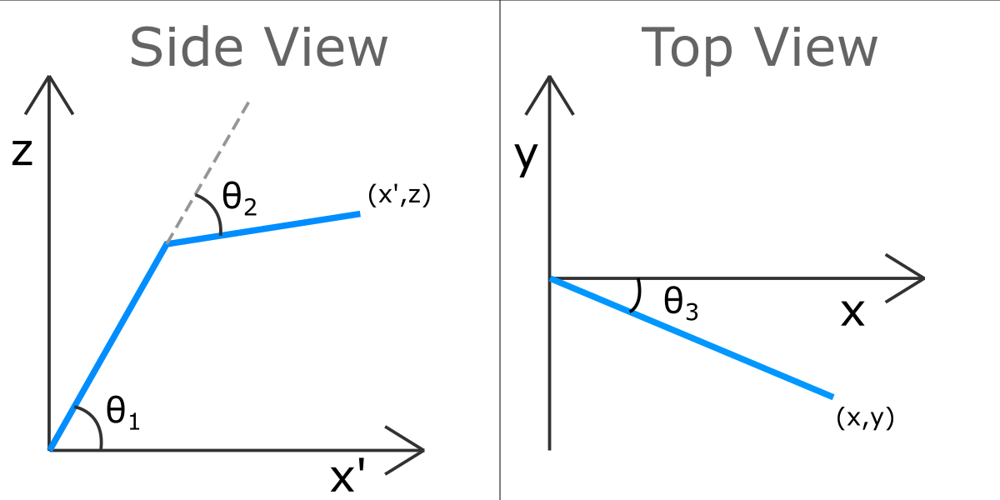

# Kinematics
Toolkit for robotic applications that require forward or inverse kinematics

This is a toolkit made for robotic applications such as robotic arms and legs that require **forward or inverse kinematics**. The library can be used with the Arduino IDE.

This toolkit allows the user to control the translational position of the end effector **(x,y,z)** by varying the angles of the 3 motors **(theta1, theta2, theta3)** corresponding to the 3 degrees of freedom.



## How to use:
1. **Installing:**
First you need to import the library into the Arduino IDE.
    * Open up the Arduino IDE
    * Download this repository
    * Go to `Sketch > Include Library > Add .ZIP Library` 
    * Select this repository and your done
2. **Testing:**
Make sure that everything works before trying other things.
    * Go to `File > Examples > Kinematics > simpleTest`
    * Compile the program and upload it
    * Open the Serial Monitor
    * And make sure you get the right messages (the comments on the code say what to expect)
3. **Using:**
    * To include the library in your project, go to `Sketch > Include Library > Kinematics`
    * Alternatively you can type the following at the top of your code
    ```c
    #include <Kinematics.h>
    ```
4. **Useful Functions:**
The toolkit provides easy to use functions to control the kinematics of the robot

    * Create a kinematics object by passing the lengths of the joints as parameters:
        ```
        Kinematics k(15, 10);
        ```
    * To move the motors to desired angles use: (90, -90, and 45 refer to theta1, theta2 and theta3 respectively)
        ```
        k.moveToAngle(90, -90, 45);
        ```
    * To move the end effector to a desired position use: (8, 12 and 6 refer to the x, y and z coordinates)
        ```
        k.moveToPosition(8, 12, 6);
        ```
    * The library also provides the functions `k.printPositions();` and `k.printAngles();` that print the current position of the end effector and the currrent angles of the motors into the serial monitor.
    * Two new datatypes are also created to store the position and angles. 
        ```c
        Position p;
        Angle a;
        ```
        The variable `p` will store the x, y, z position of the end effector and `a` will store the angles theta1, theta2, theta3 and          these values can be accessed using the dot operator
        ```c
        float x = p.x;
        float y = p.y;
        float z = p.z;
        
        float theta1 = a.theta1;
        float theta2 = a.theta2;
        float theta3 = a.theta3;
        ```
    * Finally the functions `k.getPositions()` and `k.getAngles();` return a Position datatype that contains the current position and an Angle datatype that contains the current angles.
        ```
        Position p = k.getPositions();
        Angle a = k.getAngles();
        ```
    
    
